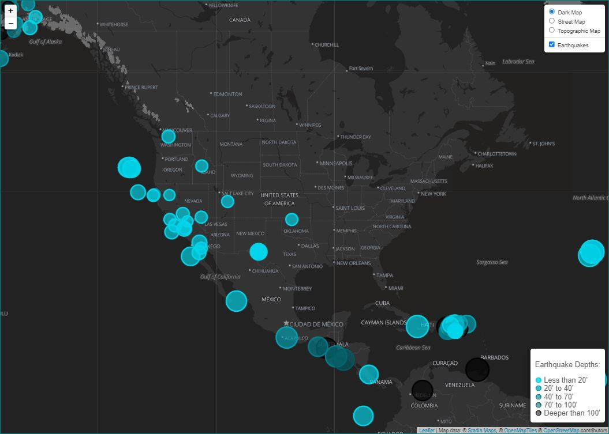
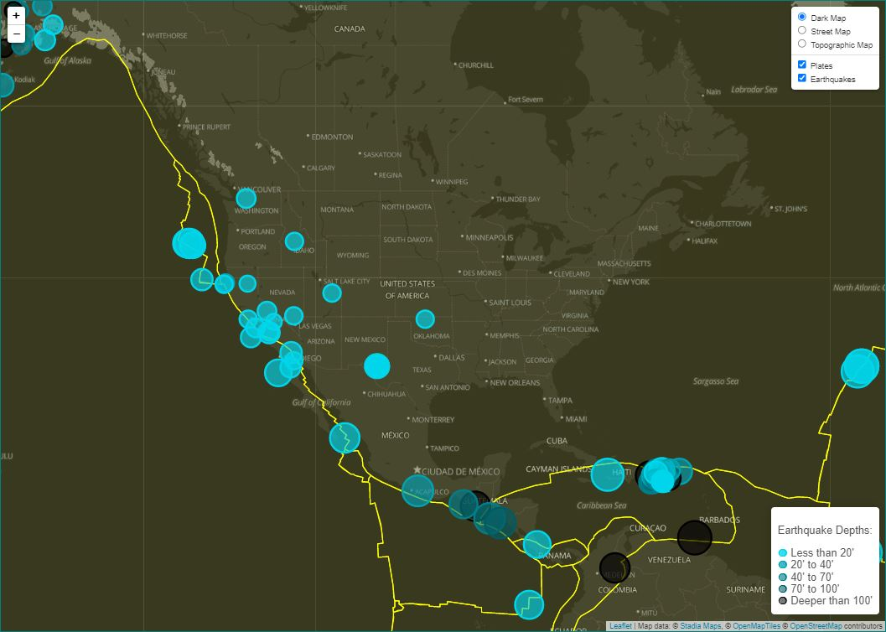

# Learning Leaflet: Visualizing Data with Leaflet

## Background

The purpose of this project is to help me better understand Leaflet in javascript. In this project I used data from the [United States Geological Survey](http://earthquake.usgs.gov/earthquakes/feed/v1.0/geojson.php), or USGS, to display earthquake data on a map.

I also referenced [this GitHub page](https://github.com/fraxen/tectonicplates) for a json file of tectonic plates, to layer under the earthquake data. *This can be seen in the folder Leaflet-Step-2*.

### Basic Visualization

The earthquake data is represented as blue dots on the map. The larger the dot, the higher the magnitude of that earthquake. The darker the dot, the deeper underground the origination point of the earthquake.

Clicking on an earthquake dot will provide more information.

### More Data

The Leaflet-Step-2 folder contains a second data set on the map to illustrate the relationship between tectonic plates and seismic activity. You will need to pull in a second data set and visualize it alongside your original set of data. Data on tectonic plates can be found at <https://github.com/fraxen/tectonicplates>.

Step 1:

Step 2:
